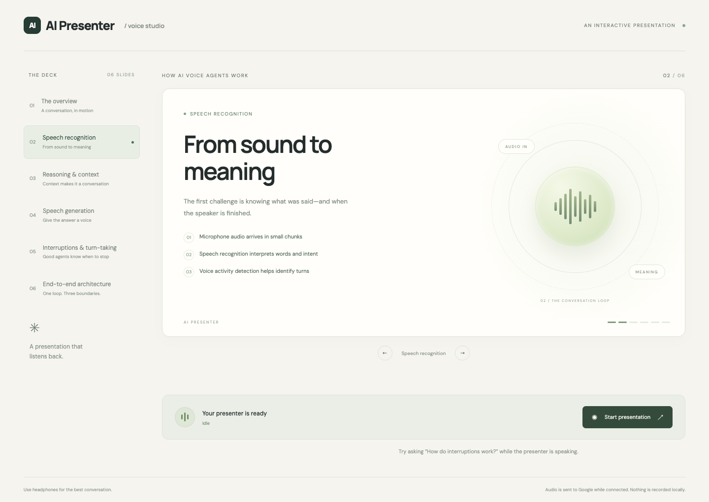

# AI Presenter — a presentation that listens

A small voice presentation prototype built with React, TypeScript, Node.js, and Gemini 3.1 Flash Live Preview. It presents a fixed six-slide deck about AI voice agents, accepts spoken interruptions, answers in context, and changes slides by meaning.



## Run locally

Requirements: Node.js **22.18 or newer**, npm, Google Chrome, a microphone, an internet connection, and a Gemini API key with access to `gemini-3.1-flash-live-preview`. The project was tested on macOS with Node 26 and Chrome.

```sh
npm ci
cp .env.example .env
```

Edit `.env` locally and set `GEMINI_API_KEY` to your own key from [Google AI Studio](https://aistudio.google.com/api-keys). Never commit this file. Then run:

```sh
npm run dev
```

Open **http://127.0.0.1:5173**, click **Start presentation**, and allow microphone access. The backend listens only on `127.0.0.1:3001`. Both ports must be free. Use headphones for the most reliable interruption test and close other voice assistants that may share the microphone.

To run the production build locally:

```sh
npm run build
npm start
```

Open **http://127.0.0.1:3001**. Local HTTP works for microphone capture; a remotely hosted version would require HTTPS and additional security work.

## What to try

- Start at slide 1 to hear the presentation progress through all six slides.
- While slide 2 is speaking, ask **“How do interruptions work?”** The old audio stops, slide 5 appears, and the agent answers.
- Ask **“Explain this slide like I’m ten.”** It should simplify the current slide without changing slides or resuming the deck.
- Say **“Switch to slide six.”** It changes slides silently.
- Say **“Switch to slide three and explain it.”** It changes slides and explains only that slide.
- Say **“Resume the presentation.”** It resumes sequential narration from the saved position. An explicit navigation/explanation request establishes a new resume position; a topic question preserves the interrupted presentation position.
- Use **Mute microphone**, **Explain slide**, **Resume**, or **End session** as needed. Clicking a slide or next/previous only selects it; selection does not narrate it.

A short recording walkthrough is in [docs/demo-script.md](docs/demo-script.md). Test coverage and known limits are in [docs/verification.md](docs/verification.md).

## Architecture

```text
Chrome / React
  microphone -> AudioWorklet -> local speech detector
  slide display <- state events
  AudioContext playback queue <- PCM audio
             | local WebSocket
Node.js backend
  credential loading + session state + validated tools
             | authenticated Gemini Live WebSocket
Gemini 3.1 Flash Live
  audio understanding + deck context + reasoning + speech
```

The full deck is stored in `shared/deck.json`, with stable numeric IDs, slide text, and speaker notes. The browser and backend share it. The model gets the full deck and current slide context. `go_to_slide` validates the requested ID and distinguishes switch-only, explanation, and question-answering intent. `presentation_control` handles next, previous, explain, pause, and resume. A backend state machine keeps the visible slide, presentation position, and Q&A mode synchronized.

### Key decisions

- **Fixed structured deck:** meets the assignment with little setup and makes semantic navigation testable. Uploads and slide generation are intentionally not included.
- **Backend proxy:** the permanent API key never reaches browser code. The configuration loader explicitly reads repository `.env`, so a conflicting inherited shell key cannot silently replace it.
- **Gemini 3.1 Flash Live:** one real-time provider handles understanding, reasoning, and speech. The integration uses `realtimeInput.text` for ongoing text updates and synchronous tool responses. It was verified with a free-tier project; availability and limits may change.
- **Local interruption detection:** an energy detector on echo-cancelled microphone PCM stops playback without waiting for a remote recognition round trip. It buffers speech onset and sends explicit activity-start/end events to Gemini. Roughly 170 ms of sustained signal triggers detection at the configured chunk size, followed by about 600 ms of silence to end a turn. These are detector settings, not guaranteed real-world latency.
- **Audio epochs and playback drain:** interruption clears active and queued audio. Epoch checks reject stale chunks. Sequential slides advance only after playback finishes, not merely when generation finishes.
- **Silent navigation is enforced:** switch-only tool results disable outgoing narration. Same-slide follow-ups can answer directly without a tool, so useful answers are not accidentally muted.
- **Small local prototype:** one session at a time, with a ten-minute session limit. No login, database, or persistent recordings.

## Tests

The normal test suite uses synthetic data and does **not** call Gemini:

```sh
npm run typecheck
npm test
npm run build
npm run test:browser
```

Browser tests use an isolated installation of Google Chrome, fake microphone input, and intercepted provider messages. Install Chrome first. They check the actual frontend; they do not connect to your existing Chrome profile. Stop other development servers before testing to ensure the suite runs against this checkout.

Optional live provider check, consuming the configured project's quota:

```sh
npm run probe:live
```

This is capped at 45 seconds, sends a fixed nonsensitive text question, validates a tool response and returned audio, and does not record audio. It must not be used with paid credentials unless you intend to pay. There is no automatic fallback to a paid model and no billing setup in this application.

## Privacy and limits

Microphone audio is transmitted to Google while the session is active and speech is detected. The app does not save audio or conversation transcripts to disk; captions are kept only in browser memory. Google's free-tier data handling may permit product improvement and human review: review [Gemini API terms](https://ai.google.dev/gemini-api/terms) before sending sensitive content.

This is a local take-home prototype, not a production multi-user service. Speech recognition, voice activity detection, network latency, and provider availability affect results. Background noise or speaker echo can cause false interruptions; headphones are recommended. Gemini preview models may return service errors, in which case start a new session. There are no slide uploads, generated decks, login, database, avatars, or deployment infrastructure. A demo recording is not bundled; the script is provided for a short hands-on recording.

## Troubleshooting

- **Microphone denied:** allow microphone access in Chrome's site settings, then start again.
- **Connecting fails:** ensure both servers are running and ports 5173 and 3001 are free. Use the exact localhost address above.
- **Missing key:** copy `.env.example` to `.env` and supply your own key. `.env` takes precedence over inherited environment variables.
- **Quota or provider failure:** check the selected project's Live access and quota in AI Studio. The app does not enable billing. Wait or start a new session after the issue clears.
- **Interruptions are noisy:** use headphones, reduce surrounding noise, and stop other active voice apps. Speak a complete question at normal volume.
